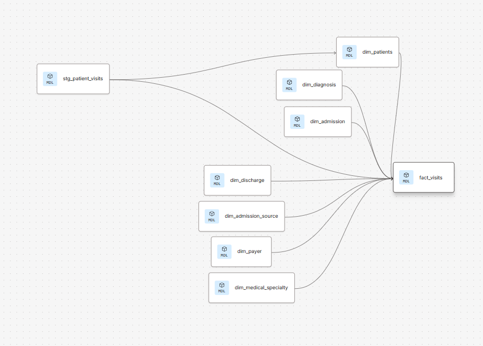
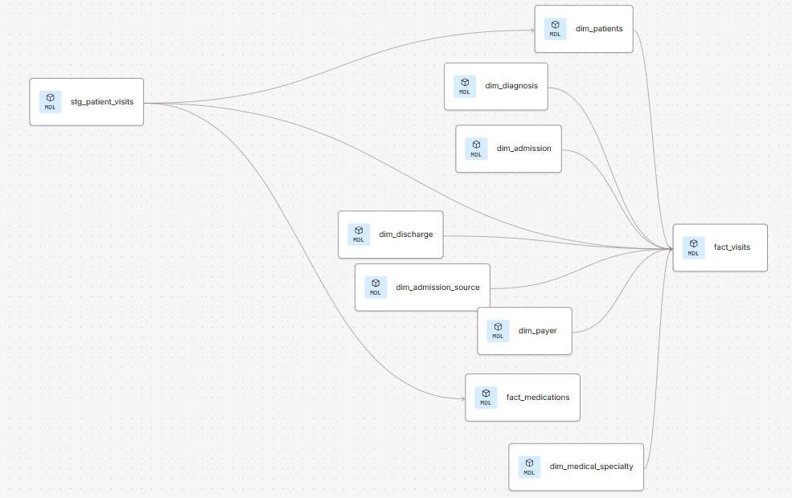

# 🏥 Hospital Readmission Analytics – dbt Project

This repository contains the **dbt transformations** for the Hospital Readmission Analytics pipeline.  
It models raw hospital encounter data (from Kaggle’s diabetes readmission dataset) into a **star schema** in Snowflake, enabling analytics and predictive modeling for patient readmissions.

---

## ⚙️ Data Architecture

Data flows through three layers in Snowflake:

- **RAW** → Landing zone (CSV ingestion into `RAW.PATIENT_VISITS`)  
- **STAGING** → Clean, standardized data (`stg_patient_visits`)  
- **ANALYTICS** → Final star schema with fact and dimension tables  

```text
RAW  →  STAGING  →  ANALYTICS
```

---

## 📊 Models

### Staging
- `stg_patient_visits.sql` → Cleans column names, fixes missing values, standardizes categories.

### Dimensions
- `dim_patients.sql` → Patient demographics (age, gender, race).
- `dim_diagnosis.sql` → Maps ICD-9 codes into 10 broad categories.
- `dim_admission.sql` → Admission type (emergency, elective, etc.).
- `dim_admission_source.sql` → Admission source (referral, ER, transfer).
- `dim_discharge.sql` → Discharge disposition (home, transfer, expired, etc.).
- `dim_medical_specialty.sql` → Specialty of treating/admitting physician.
- `dim_payer.sql` → Insurance/payer categories.

### Facts
- `fact_visits.sql` → Central encounter-level fact table with readmission flag.
- `fact_medications.sql` → Medication-level fact table, capturing prescriptions and changes.

---

## 🔗 Fact Visits Lineage

The **fact_visits** model is the central hub of this star schema, pulling from staging and multiple dimensions.

📸 



---

## ✅ Tests

Implemented with dbt built-in tests and custom logic:

- **Unique & Not Null** → Keys (`encounter_id`, `patient_nbr`)  
- **Relationships** → Fact keys reference dimension tables  
- **Custom Threshold Test** → Fails if more than 5% of patients have `Unknown` values in race, gender, or age group  

---

## 🚀 How to Run Locally

```bash
# Run transformations
dbt run

# Run tests
dbt test

# Generate documentation
dbt docs generate && dbt docs serve
```

---

## 📸 Additional Graphs

For completeness, here’s the **full project lineage** generated from dbt docs.  
📸



---

## 🏁 Conclusion

This dbt project powers the Hospital Readmission Analytics pipeline by creating a clean and reliable **star schema** in Snowflake.  

It provides a trusted foundation for:
- BI dashboards (Power BI, Streamlit)  
- Predictive modeling of readmission risk  
- Monitoring healthcare KPIs at scale
